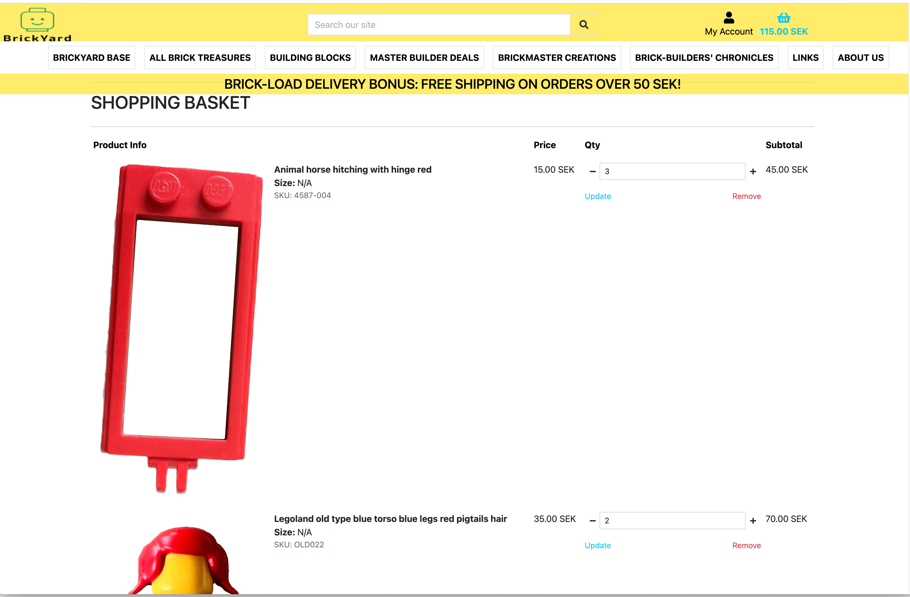
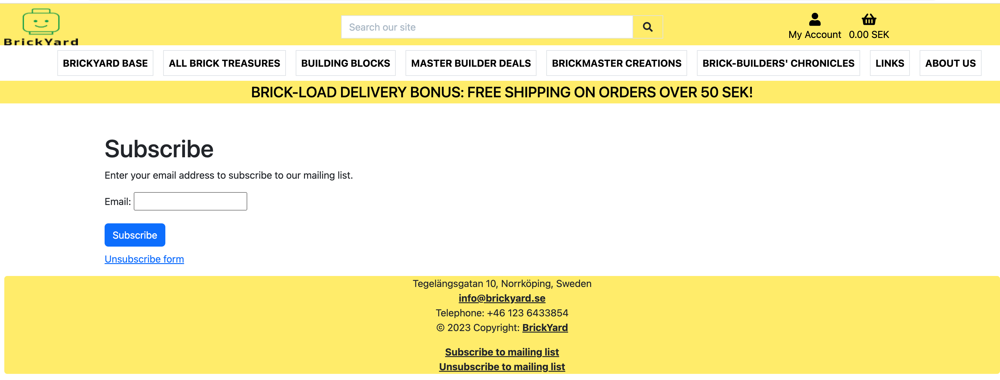
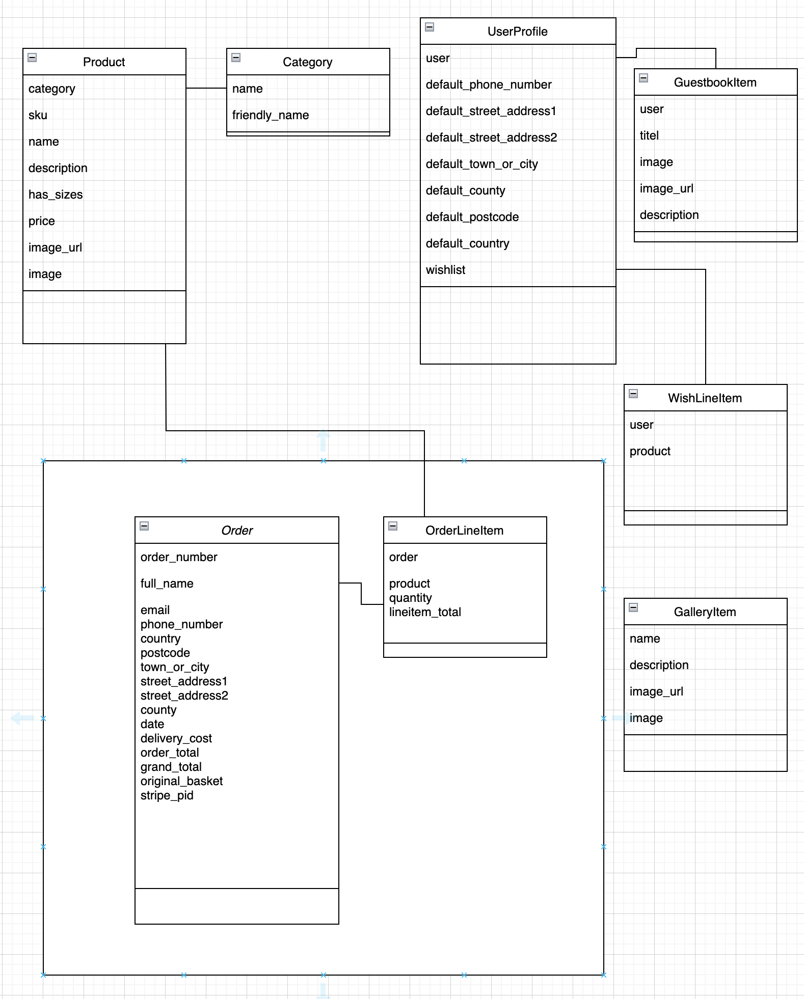
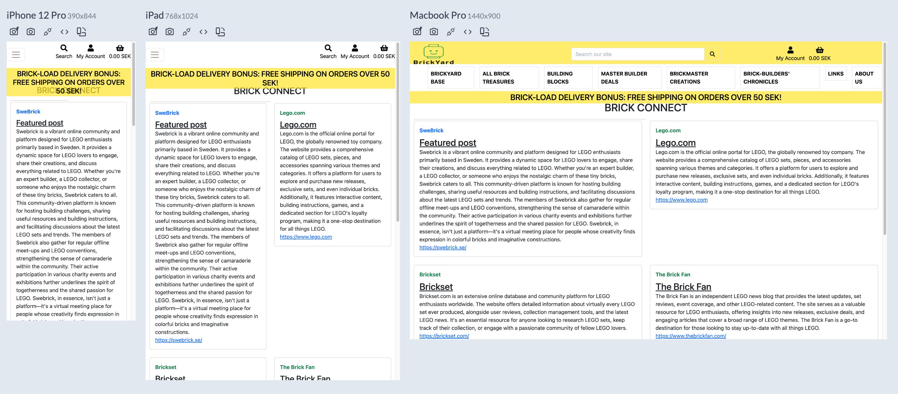
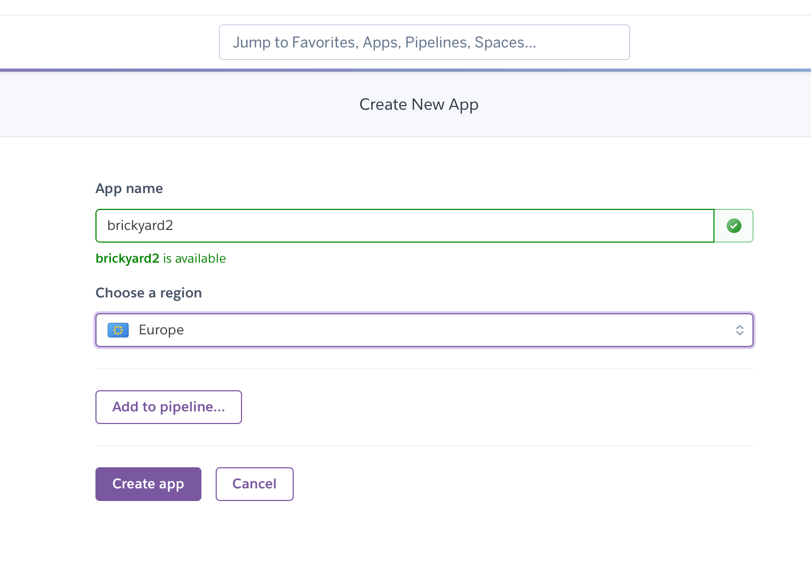

# BrickYard

BrickYard is the webshop for collectable Lego bricks and pieces for Business to Consumer.


At BrickYard, we are passionate about LEGO and dedicated to bringing you a wide range of LEGO pieces to enhance your building adventures. Whether you're a seasoned LEGO enthusiast or just starting your brick collection, we have something for everyone.

BrickYard is actually starting up as a new company using my platform that is created in this project.

As part of the project I have defined a model for article number (SKU), Lego already today have their numbers, but they doesn't take in acount the color of bricks.

BrickYard app is managed on my Github as repository BrickYard, the final production solution is deployed on Heroku with using ElephantSQL as database backend.
Domain is registered via Godaddy.com and email service is Microsoft Office 365 for domain. 
For sending marketing mail MailChimp is used for managing mailing list, API is used for subscribing user and unsubscribing.
When sending other mails Heroku add-on Mailgun is used via AnyMail django plugin. 
Payment service is integrated against Stripe.

My next step is to improve the service and go public with webshop as a real business.


The definition is: articleno = [number]-[color]
Example: 451511-002 White Lego Pieces

| color number | Color |
|--- | --- |
| 001 | Blue |
| 002 | Black |
| 003 | White |
| 004 | Red |
| 005 | Yellow | 
| 006 | Brown |
| 007 | Gray |


# Business Model

*Brickyard* operates under the e-commerce business model where we purchase large quantities of old Lego sets from sources like eBay and other online marketplaces. We then refurbish these sets, break them down into individual pieces or figures (figs), and resell them on our platform. Our primary revenue comes from selling these unique and retro Lego bricks and figs to individual consumers, collectors, and enthusiasts. 

Our competitive edge lies in our ability to source, refurbish, and offer rare and unique pieces that might otherwise be difficult to find, providing a marketplace for the niche community of Lego enthusiasts.

We already have bought several lots of Lego over 100 kg (buying in bulk), for example in these lot we have refurbished over 250 minifigs, where just around 10 of these minifigs have repaid the original investment cost.

# Marketing Strategy

1. **Target Audience Identification:** Our primary audience includes Lego enthusiasts, collectors, and individuals looking for specific rare Lego pieces or figs. We will develop detailed buyer personas to help us understand and cater to our customers' needs effectively.

2. **Online Advertising:** We will leverage targeted social media advertisements and Google Ads. These platforms allow us to target ads based on interests (e.g., interest in Legos, collectibles), enhancing our ad's effectiveness.

3. **Content Marketing:** We will establish a blog on our website that shares interesting information about the Lego universe, collecting tips, rare piece features, and other relevant content. This will not only boost our SEO efforts but also position Brickyard as a trusted resource in the Lego community.

4. **Email Marketing:** Customers will be encouraged to sign up for newsletters when they visit our website. We can then use email marketing to keep our customers informed about new product arrivals, special promotions, and other updates.

5. **Partnerships and Collaborations:** We can partner with popular Lego influencers on platforms like Pinterest, YouTube or Instagram. They can feature our products, unbox them, or use them in a build, exposing our shop to their followers.

6. **SEO Strategy:** Optimize our website and product listings with relevant keywords to ensure we appear in search engine results when customers are looking for specific Lego pieces or collectibles.


# UX design
During the project UX design where done in Figma as tool for concept and prototyping. 

Example of pages from UX design:

This is the home page.


This is the shop page.


This is the item detail page where you can read more about every item when you have click on it.


This is the about us page and on this page you have the information to contact us with.


This is the checkout page. This page are missing some stuff on the UX design. 


This is the page that comes up when you have a 404 error.


# User Stories

## User Story: Browsing the Product Catalog
1.	Story for Browsing the Product Catalog
The customer should be able to browse various Lego sets by theme, age group, and price range.

**Acceptance Criteria:**
-	User can filter Lego sets by theme, age group, and price.
-	User can sort Lego sets by popularity, new releases, and price.
-	User can see product details like the name, price, picture, and age recommendation.
2.	Story for Adding Products to the Shopping Cart
The customer should be able to add Lego sets to my shopping cart,
So that they can collect all desired sets in one place before checkout.

**Acceptance Criteria:**
-	User can add a Lego set to the cart from the product detail page.
-	User can view the number of items in the cart.
-	User can view a summary of the items added to the cart.
3.	Story for Checking Out and Making a Purchase
The customer should be able to check out smoothly and securely,
So that they can confidently make a purchase.

**Acceptance Criteria:**
-	User can view a detailed breakdown of the cart total, including taxes and shipping charges.
-	User can enter shipping and billing information.
-	User can choose a payment method and complete the payment.
-	User receives a confirmation of the purchase via on-screen message and email.
4.	Story for Writing and Viewing Reviews
The customer should be able to read and write reviews about Lego sets,
So that they can make informed purchasing decisions and share my experience with others.

**Acceptance Criteria:**
-	User can view reviews on the product detail page.
-	User can write a review, giving a star rating and leaving a comment.
-	User can view their own reviews in their account.
5.	Story for Creating and Managing an Account
The customer should be able to create an account,
So that they can save my shipping information and track my orders.

**Acceptance Criteria:**
-	User can create an account with their email.
-	User can log in and out of their account.
-	User can update their shipping and billing information.
-	User can view their past purchases and track their current orders.

## Story for Adding to and Managing a Wishlist
The customer should be able to add Lego sets to my wishlist and manage it,
So that I can save sets I'm interested in for future consideration or purchase.

**Acceptance Criteria:**
-	User can add a Lego set to their wishlist from the product detail page.
-	User can view all items in their wishlist.
-	User can remove items from their wishlist.
-	User can move or add items from their wishlist directly to their shopping cart.
-	User can share their wishlist via email or social media.


# Differant view on the website.
From the UX design work I create by hand all the webpages in product (from experience the export functions in Figma isn't perfect, also got information about that from expert UX designer that my employer is using for their products).

The resulting real pages in BrickYard (https://brickyard.herokuapp.com / www.brickyard.se):

This is the home page. On here you can read litel about what BrickYard are. 


This is a view of the store page.


This is the about us page. Here you can read about us and contact us. You can also subscribe so you can get emails when new products comming up.


This is the shopping basket. Here you can se all your products you have added to shopping baskets.


This is the Signup for new account page.


Signup page for mailing list, using Mailchimp in backend side.


# Features

The main functionalities for the Brickyard webshop platform is to provide a nice and easy interface for customer to read about products. Place in shopping basket and checkout to order products.

It possible to register and login as customer and a seperate Role for superuser.

Super user can add, edit and delete products in product register. Each product can have image and prices. 

User that has logged in for its account can add products to their wishlist.

Martketing support via Mailchimp for mailing list

Customer login for handling profiles and checkout

When placing a order, products get added to shopping basket, for Checkout is done Stripe payment service and verification emails are sent for order confirmation.

When user is logged in to Brickyard they can add products to a Wishlist, where user can easy then get to product detail page.
If user not logged in and view a product details and press "Add to wishlist" then user is requested to login.


## Future improvement
- Handle product stock and warehousing
- Enable bought TLS/SSL certificate of the Heroku service and use brickyard.se domain fully
- Image resizing via Cloudinary is required for the shop.
- My own step in development is to study and learn React (and also React Native), so my goal is to change frontend code to React Frontend.

# Data model
Datamodel is implemented with Django framework and custom database has been added for wishlist and some more items.


  
 # Social media
  I have created Pintrest (@brickyard_lego_store) and Instagram (@brickyard_lego_store) account for BrickYard, these social networks are the primary channel for BrickYards customers.
  
  But I have made a mockup Facebook for Business page as below:
  
  


# Software solutions
In the Brickyard project different components and tools has been used for design, development and deployment.

## Development environment
The developement environment is based on Visual Code hosting via GitPod and some other tools according to below.

The development environment consist of:
1. GitHub - Source control, project management and wikipage
2. Figma - Web based UX design tool for creating prototype look and UX design
3. GitPod - Web based Visual Code (also remote use of Visual code), development server and staging environment
4. Visual Code - Development IDE for writing and remote work against Gitpod servers
5. responsively-app - Open Source tool for check resposive web pages better than AmIResponsive (https://github.com/responsively-org/responsively-app)

**Setup of development setup**
1. Checkout project via GitPOD button on Github.
2. Install all needed python packages from requirement file
'''
pip install -r requirements.txt
'''
3. Create a ".env" based on template file in repo "env_template" and setup all the key values to proper servers
```
SECRET_KEY=""
STRIPE_PUBLIC_KEY=""
STRIPE_SECRET_KEY=""
STRIPE_WH_SECRET=""
MAILCHIMP_API_KEY = ""
MAILCHIMP_REGION = ""
MAILCHIMP_MARKETING_AUDIENCE_ID = ""
DATABASE_URL=""
CLOUD_NAME=""
API_KEY=""
API_SECRET=""
MAILGUN_SMTP_SERVER=””
MAILGUN_SMTP_PORT=""
MAILGUN_SMTP_LOGIN=””
MAILGUN_SMTP_PASSWORD=””
MAILGUN_API_KEY=""
MAILGUN_DOMAIN=""
SENDER_EMAIL=""
MAILGUN_API_URL=""

```

For description on parameters see under Deployment section the table.

4. If needed run "makemigrations" and "migrate" on django project
'''
python manage.py makemigrations
python manage.py migrate
'''
5. Ready to run development server
'''
python manage.py runserver
'''

## Production environment
The production enviroment is for final testing and system setup.
1. Heroku - Application server setup and build streams
2. ElephantSQL - For hosted PostgresSQL server
3. Godaddy - Registration of domain Brickyard.se and DNS servers
4. Microsoft 365 - Hosting mailserver for incoming mails for Brickyard.se
5. Mailchimp - Managing of mailling list
6. Stripe - Payment checkout service

## Module dependencies
- Django 4.1.6 - Used for backend and data model management and web rendering
- Stripe - Payment checkout service 
- Cloudinary - Storing and manage static files and media files
- Bootstrap 5.0 - Frontend templates for create CSS and design easy
- Django allauth - for user management
- AnyMail - for interface mail sending
- Pylint - Validation of PEP8 coding style (https://www.pylint.org/)
- Black - Python code formatter (https://github.com/psf/black)
- Pytest - Automatic testing (https://docs.pytest.org/en/7.3.x/)


# Testing and Validation

Validation and testing of Brickyard project has been done continuesly during the development, but in a structured way.

Validation been using different tools like Black and pylint.

Part of functionaly testing validation of different browsers and screen setup has been done.


## Validation
First level of verification is done in code validation and formatting by using Black formatter in Visual Code and also in command line. 

Second level of validation is done via using Pylint to validate coding and formatting error according to PEP8.

**Black**
Running Black (https://github.com/psf/black) to validate coding style and format, Black formatter is quite uncompromising and make code clearer and actually run faster.

All the code modules been run via Black formatter before running pylint.

**Pylint**
Pylint is runned in background of Visual and gives warning continuesly, where I have fixed and modified to comply with PEP8.

Most of the reported issues has been fixed, some constributed code has some details that are kept.

## Responsively App
The desktop app "responsively-app" is Open Source tool for check resposive web pages, which function better than AmIResponsive.

BrickYard webpage been validatate via that app.


## Browser and platform testing

Validation of different operating systems and browsers to validate compability has been using devices like:


- Macbook PRO 16" - Mac OS Sonoma
    - Safari Version 17.0 (19616.1.14.11.11)
    - Firefox Version 114.0.1
    - Chrome Version 114.0.5735.106 (Officiell version) (arm64)
- iPhone Pro Max 14 - iOS 17 beta
    - Safari
    - Chrome

Screenshot from iPhone Pro Max 14:


Screenshot from Macbook Chrome:


## Google Chrome Lighthouse 

Google Chrome Lighthouse verification been done using Chrome and inspector view with lighthouse.


## Manual test case

Functional and manual testing has been done of the Brickyard platform according to testplan below.

| Test No. | Description | Expected result | Test OK | 
| --- | --- | --- | --- |
| 1. | Open main page of Brickyardd | Page loading with all the content | PASS |
| 2. | Click on Navbar to select about us | Page loading About us page | PASS |
| 3. | Testing different screen sizes | Reactive results of pages | PASS |
| 4. | Use Search bar to search for different products | Product listing with correct search result | PASS |
| 5. | Click on "Subscribe to mailing list" and enter email to subscribe | validate in Mailchimp that account is added | PASS |
| 6. | Click on "Unsubscribe to mailing list" and enter email to unsubscribe | validate in Mailchimp that account is removed | PASS |
| 7. | Click on "Parts" and all parts to show all parts listing | Validate page that they are correct | PASS |
| 8. | Add several parts to shopping basket | Validate that sum is correct and go to shopping basket to see products | PASS |
| 9. | Remove products from shopping basket and change amount | Validate that remove and count is changing correct | PASS |
| 10. | Do a checkout buy of products in basket | Validate that testing credit card and order confirmation on mail works | PASS |
| 11. | Login as superuser / admin and add, delete and update products | Validate that function for product management works | PASS |
| 12. | Under product details add product to wishlist | Validate that wishlist can add, delete and go to product details | PASS |

### Notes

***Stripe and checkout testing***

When testing the checkout and Stripe there is from Strip a example creditcard according to:

When testing interactively, use a card number, such as 4242 4242 4242 4242. Enter the card number in the Dashboard or in any payment form.
Use a valid future date, such as 12/34.
Use any three-digit CVC (four digits for American Express cards).
Use any value you like for other form fields.


## Automatic testing
Automatic testing has been built in to Brickyard codebase using Django-pytest framework.

To execute the testing according to:
```
python manage.py test product
python manage.py test wishlist
```

The main component for testings for the following modules and tests:
| Module | Description |  Expected result | Result |
| --- | --- | --- | --- |
| Product | TBD| TDB | |
| Wishlist | TBD | TDB | |


# Bugs
The development was done iterative and testing and finding bugs occure during the coding process.

## Remaining bugs
- No known bugs

## Deployment

The production environment using Heroku as app server with additional plugins and hosting Postegresql database on ElefantSQL.

**ElefantSQL setup**
Start by setting up new SQL server

1. Create a new account if needed
2. Click on creating a new instance

3. Fill in name for new instance

4. Select region for server (Brickyard run servers in Nordics)

5. Confirm creation and you back to list of instances

6. Go in the newly create instance and copy the Database URL, its needed to environment variables i Heroko


**Heroku setup**
Start by login to Heroku (create a new account if needed).

1. Create a new App in Heroku

2. Select name of the app instance and region (Brickyard run in Europe region)

3. Press "Create app" and you will come to the App page and tab for Deployment
4. Choose Github (Connect to GitHub) button

5. Connect to the Brickyard Github repo and search for it to link it

6. Go to tab "Resources"

7. Look for plugin "Mailgun" and choose that one

8. Choose the "Submit Order form"
9. Follow the process in Mailgun page and get the domain attenticated
10. Get API keys for Mail and env values
11. In Heroko and our Brickyard app, go to Settings tab

12. Click on "Add buildpack"
13. Choose heroku/python and press "Add buildpack"

14. Under Settings tab click on "Configure SSL" and select "Automatic Certificate Management (ACM)"

15. Press "Next" and SSL certifcate will be setup
16. Under Settings tab click on "Reveal Config Vars", that will show the enviroment parameters, here paramenters for all the api need to be added with proper values

17. The Enviroments parameters to be added are as in env_template but according to table below:

| Module | Description |  Source | 
| --- | --- | --- |
| PRODUCTION | Set the value to 1 to force PRODUCTION mode | Handwritten in Heroku |
| SECRET_KEY | Django Secret key for database salt | Django inital setup |
| DATABASE_URL | Database URL for SQL server | ElephantSQL |
| STRIPE_PUBLIC_KEY | Stripe Public key value for API | Stripe |
| STRIPE_SECRET_KEY | Stripe Secret key value for API | Stripe |
| STRIPE_WH_SECRET | Stripe webhook secret key | Stripe |
| MAILCHIMP_API_KEY | Mailchimp API key | Mailchimp |
| MAILCHIMP_REGION | Mailchimp region | Mailchimp |
| MAILCHIMP_MARKETING_AUDIENCE_ID | Mailchimp Marketing audience ID | Mailchimp |
| CLOUD_NAME | Cloudinary Cloud name | Cloudinary |
| API_KEY | Cloudinary API Key | Cloudinary |
| API_SECRET | Cloudinary secret | Cloudinary |
| SENDER_EMAIL | Email that system uses to send from | self defined |
| MAILGUN_API_KEY | Mailgun API key | Mailgun |
| MAILGUN_API_URL |  Mailgun API URL key | Mailgun |
| MAILGUN_DOMAIN |  Mailgun domain key | Mailgun |
| MAILGUN_HOST |  Mailgun host key | Mailgun |
| MAILGUN_PUBLIC_KEY |  Mailgun Public key | Mailgun |
| MAILGUN_SMTP_LOGIN |  Mailgun SMTP login user | Mailgun |
| MAILGUN_SMTP_PASSWORD |  Mailgun SMTP password | Mailgun |
| MAILGUN_SMTP_PORT |  Mailgun SMTP port | Mailgun |
| MAILGUN_SMTP_SERVER |  Mailgun SMTP server | Mailgun |

18. Go to tab "Deploy" and select manual build for first deployment


**Stripe setup**
Start by creating account and select Stripe Connect service.

1. Choose Developer and Test mode
2. Go to tab API-key and get the keys for environment settings
3. Go to tab "Webhooks" to setup webhook for Heroku endpoint


**Mailchimp setup**
Start by creating account and select Mailchimp.

Create a compain and get the API keys and ccompain numbers for API values in Environment variables.

# Credits
- Special thanks to Patrik Lindergren and Quagga Technologies AB for sponsering with Heroku and Figma account.


